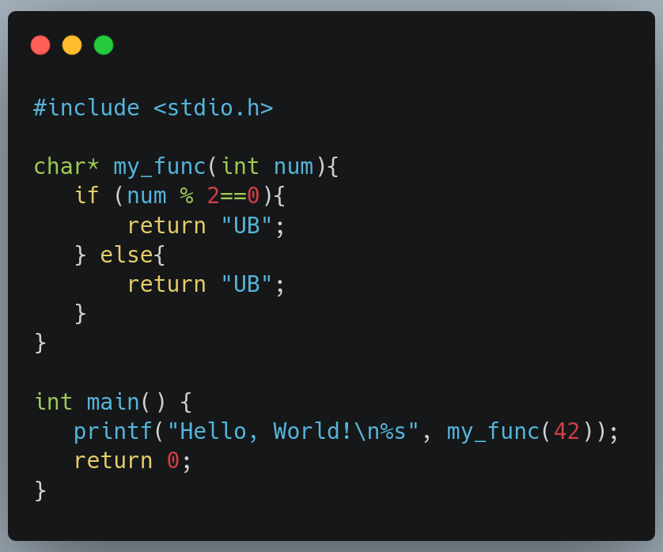

# Code samples для ДОД НГУ Syspro

## C

### История языка C

Легендарный язык программирования, разработанный Деннисом Ритчи в 1972 году для реализации операционной системы UNIX. Является одним из наиболее влиятельных языков программирования в истории, список языков позаимствовавших у этого языка включает в себя такие языки как C++, Java, Go, JavaScript, Python, однако на них не заканчивается. Среди программ написанных на этом языке можно выделить: Linux, git, ранние версии Windows, SQLite.

### Особенности языка

- Маленькое количество ключевых слов позволяет быстро выучить синтаксис языка.
- Ручное управление динамической памятью с помощью `malloc`, `free`, и т. д.
- Прямое взаимодействие с памятью с помощью механизма указателей.
- Огромное количество мест где можно выстрелить себе в ногу!

### Объяснение программы

Выполнение программы в этом языке начинается с функции main, которая записана в коде как int main(). int в данном случае говорит нам о том, что функция возвращает значение типа int, а в скобочках должны находится аргументы, которая эта функция принимает, и отсутствие в скобочках чего-либо, говорит нам о том, что в этом контексте функция не принимает ничего. Код, относящийся к этой функции находится внутри фигурных скобок и выполняется построчно. printf - функция стандартной библиотеки, которая отвечает за вывод информации в файловый дескриптор, обозначенный как стандартный вывод в пределах этой программы, обычно в терминал, в котором эта программа исполняется. Функция printf принимает аргументы в скобочках, первым является текст, который должен быть выведен, а вторым, выражение, результат которого заменит `%s`. Так как этим выражением является функция `my_func`, то управление передаётся в неё. `if` означает, что если условие, написанное в скобках верно, то тогда и только тогда исполнится код в фигурных скобках после `if`'а. После `else` идёт код, который выполнится, если условие наоборот, неверно. Функция возвращает значение типа `char*`, то есть указатель на тип `char`.

